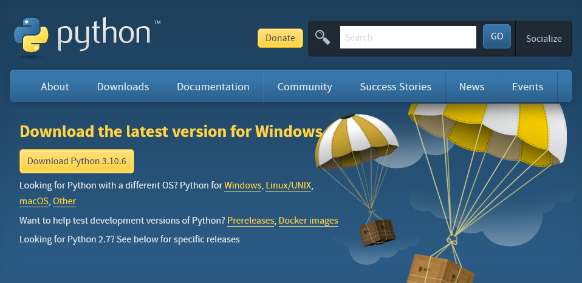

# 개발환경 구축
## 참고사항
- Python 3이면 어떤 버전이든 상관 없음 (3.6, 3.7 등..)
## Python 설치
- https://www.python.org/

- `Downloads`

- `Download Python 3.10.6`
## VSCode 설치
- https://code.visualstudio.com/

- Download for Windows/macOS(자신의 OS)
### Python 확장기능 설치